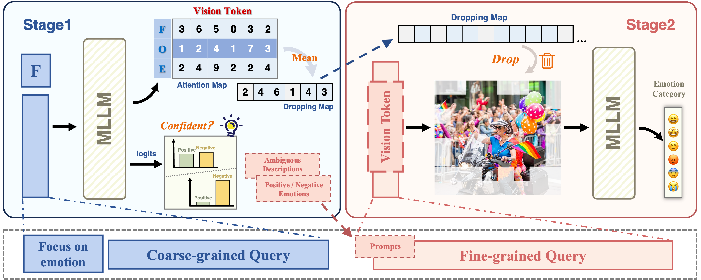

# [ICML'25 Spotlight] Catch Your Emotion: Sharpening Emotion Perception in Multimodal Large Language Models
> Catch Your Emotion: Sharpening Emotion Perception in Multimodal Large Language Models,            
> Yiyang Fang, Jian Liang, Wenke Huang, He Li, Kehua Su, Mang Ye
> *ICML, 2025*, [Link](https://openreview.net/pdf?id=IYOksPHJKT)
>
> <div align="center">

</div>

## News
* [2025-07-12] Code has been released.
* [2025-05-27] Repo created. Code will be released soon.

## Abstract
<div align="justify">
Multimodal large language models (MLLMs) have achieved impressive progress in tasks such as visual question answering and visual understanding, but they still face significant challenges in emotional reasoning. Current methods to enhance emotional understanding typically rely on fine-tuning or manual annotations, which are resource-intensive and limit scalability. In this work, we focus on improving the ability of MLLMs to capture emotions during the inference phase. Specifically, MLLMs encounter two main issues: they struggle to distinguish between semantically similar emotions, leading to misclassification, and they are overwhelmed by redundant or irrelevant visual information, which distracts from key emotional cues. To address these, we propose Sharpening Emotion Perception in MLLMs (SEPM), which incorporates a Confidence-Guided Coarse-to-Fine Inference framework to refine emotion classification by guiding the model through simpler tasks. Additionally, SEPM employs Focus-on-Emotion Visual Augmentation to reduce visual redundancy by directing the attention of models to relevant emotional cues in images. Experimental results demonstrate that SEPM significantly improves MLLM performance on emotion-related tasks, providing a resource-efficient and scalable solution for emotion recognition.
</div>

## Preparation
1. Clone this repository and navigate to SEPM folder.
```bash
git clone https://github.com/fuyyyyy/SEPM.git
cd SEPM
```

2. Install necessary package.
```Shell
conda create -n sepm python=3.10 -y
conda activate sepm
pip install --upgrade pip 
pip install -e .
```

3. Download EmoSet dataset [here](https://github.com/JingyuanYY/EmoSet) and question/stage_1.jsonl [here](https://drive.google.com/file/d/11LD6LtPORgwT6Y_9iE84kKB6O9pGSvD2/view?usp=sharing), and place it in the corresponding folder.

## Usage
1. Set the correct path.

2. Single-GPU inference.
```Shell
CUDA_VISIBLE_DEVICES=0 bash scripts/v1_5/eval/emoset.sh
```

## Citation
```bibtex
@inproceedings{fangcatch,
  title={Catch Your Emotion: Sharpening Emotion Perception in Multimodal Large Language Models},
  author={Fang, Yiyang and Liang, Jian and Huang, Wenke and Li, He and Su, Kehua and Ye, Mang},
  booktitle={Forty-second International Conference on Machine Learning}
}
```


## Acknowledge
Our repo is built on LLaVA. We thank the authors for sharing their code.
